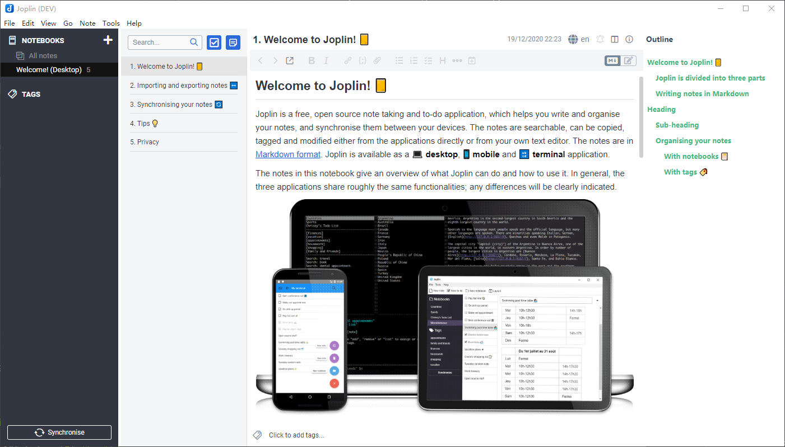

# Joplin Outline Plugin

This is a outline plugin for [Joplin](https://github.com/laurent22/joplin). Refer to [joplin toc](https://github.com/laurent22/joplin/tree/dev/packages/app-cli/tests/support/plugins/toc/)

## Features

- Support atx-style headers (`#`), not setext-style headers (`---`, `===`).

## Requirements

- Joplin 1.3.15 or higher for application plugins support.

## Building

### Building the plugin

The plugin is built using Webpack, which creates the compiled code in `/dist`. A JPL archive will also be created at the root, which can use to distribute the plugin.

To build the plugin, simply run `npm run dist`.

The project is setup to use TypeScript, although you can change the configuration to use plain JavaScript.

### Updating the plugin framework

To update the plugin framework, run `yo joplin --update`

Keep in mind that doing so will overwrite all the framework-related files **outside of the "src/" directory** (your source code will not be touched). So if you have modified any of the framework-related files, such as package.json or .gitignore, make sure your code is under version control so that you can check the diff and re-apply your changes.

For that reason, it's generally best not to change any of the framework files or to do so in a way that minimises the number of changes. For example, if you want to modify the Webpack config, create a new separate JavaScript file and include it in webpack.config.js. That way, when you update, you only have to restore the line that include your file.

## Installation

To install joplin-outline, copy outline.jpl to your profile's `plugins` directory. The outline will be automatically loaded and executed when you restart the application.

## Community

[A markdown outline sidebar plugin for Joplin](https://discourse.joplinapp.org/t/a-markdown-outline-sidebar-plugin-for-joplin/13364)

[Toc as the sidebar](https://discourse.joplinapp.org/t/toc-as-the-sidebar/5979/64)
